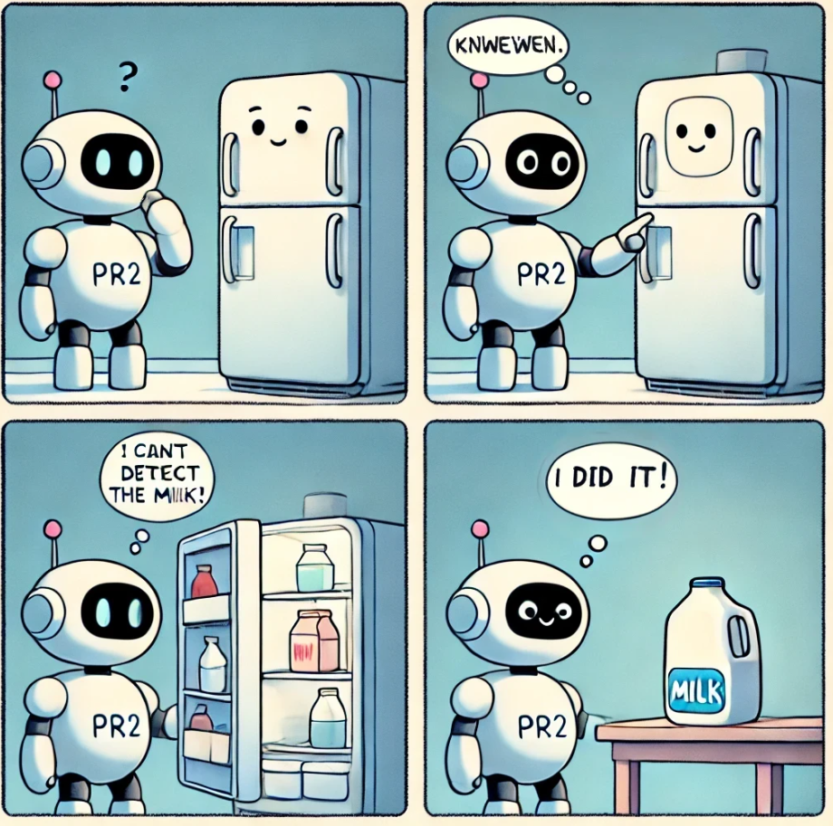

<div class="hidde-after-preview">
To understand the course, we will provide a brief overview of the entire course. 


  For Entering the Story click here:
  <a class="btn btn-success" target="_blank" href="chapter0/"><b>Story Mode Activate!</b></a>
</div>


<!--more-->

 <h1> Welcome to PR2's first Mission!</h1>
```markdown
## Welcome to PR2's first Mission!

**The Story**

Once upon a time, there was a robot named PR2, tasked with helping its human companions in their daily routines. PR2 could perform complex tasks like cooking breakfast or tidying up the living room.

<p align="center">
  <br>
</p>

**Problem**

One morning, PR2's mission was simple: fetch the milk for breakfast. The milk was kept in the fridge. With its sensors and object detection algorithms, PR2 was certain it could locate the milk without trouble. It approached the kitchen, activated its detection systems, and scanned the room for the familiar white carton.

After several moments, PR2 grew puzzled. There was no milk in sight. The robot rechecked its belief database, confirming the milk should be in the fridge, yet all it could perceive was the fridge door standing silently in front of it. No sensor could see through solid matter.

Then came the realization: the fridge door was closed. Until it opened the door, the milk would remain out of reach, not just physically but perceptually.

**Understanding**

PR2 had run into a basic truth about the world: things are hidden until the environment changes. The fridge door blocked its sensors entirely.

Some actions are prerequisites for others. Opening the fridge wasn't merely a step toward retrieving the milk; it was necessary for perceiving the milk at all. Just as humans understand intuitively that opening doors and cabinets reveals hidden objects, PR2 needed to learn these causal relationships.

**The Solution**

PR2 opened the fridge door. The milk appeared, sitting on the middle shelf. With its sensors now able to detect the carton's shape and color, the robot completed its task.

From that point on, PR2 understood that interacting with an environment requires considering not just the objects to manipulate, but the steps needed to perceive them in the first place.

---

## The Quest

PR2's journey has just begun. Your objective: help PR2 retrieve the milk from the fridge and place it on the table. PR2 must first open the fridge before it can perceive the milk inside.

**Questline Steps**

Step 1: Create the World. Build the environment PR2 will navigate. Construct a URDF model with a fridge, table, and the key items PR2 will interact with.

Step 2: Let the Robot Perceive the Milk. Program PR2 to move to a specific location and use its sensors to detect the milk carton.

Step 3: Query the Knowledgebase. Before PR2 can see the milk, it needs to understand that the fridge door must be opened. Program this action as part of the task.

Step 4: The Final Task. Open the Fridge. With the fridge open, PR2 can scan and detect the milk carton inside. Help it fetch the milk and place it on the table.

**The Goal**

By the end of Chapter 5, PR2 will be fully equipped to execute this task in simulation.
```


<div class="main-well-flex-container" style="margin:20px;align-items: center;">

  <div style="flex:30%;">
      
  </div>

  <div style="flex:70%;">
       <h3> Vanessa Hassouna</h3>
    Tel:  +49 421 218 99651 <br>
    Mail:     <a href="mailto:hassouna@cs.uni-bremen.de">hassouna@cs.uni-bremen.de</a> <br>
      <a style="color:red" href="https://ai.uni-bremen.de/team/vanessa_hassouna">
      <span style="font-size: 15px;">Profile Vanessa Hassouna</span>
    </a>
  </div>
</div>

<div class="main-well-flex-container" style="margin:20px;align-items: center;">

  <div style="flex:30%;">
      
  </div>

  <div style="flex:70%;">
       <h3> Prof. Michael Beetz PhD</h3>
    Tel:  +49 421 218 64001 <br>
    Mail:     <a href="mailto:beetz@cs.uni-bremen.de">beetz@cs.uni-bremen.de</a> <br>
      <a style="color:red" href="https://ai.uni-bremen.de/team/michael_beetz">
      <span style="font-size: 15px;">Profile Michael Beetz</span>
    </a>
  </div>
</div>

